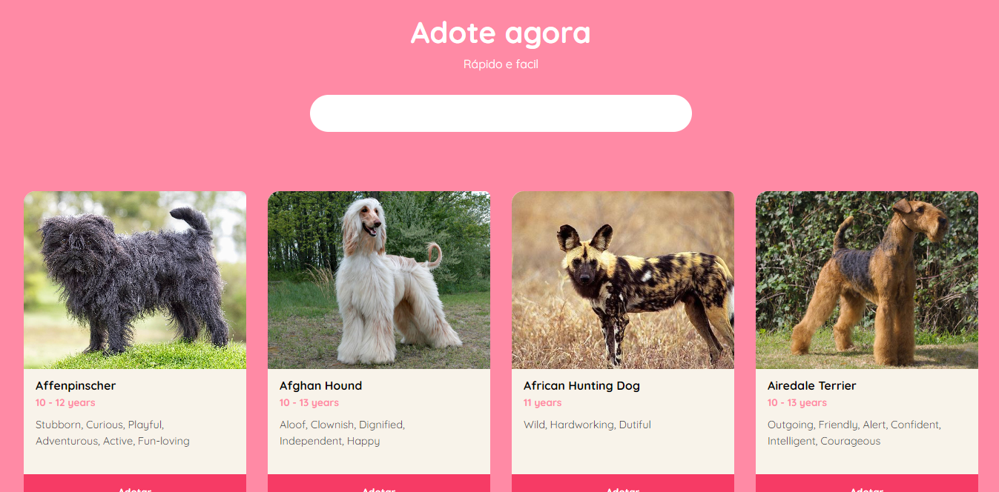

<h1 id="inicio" align="center">AdotaCão</h1>

    <b weight="bold">🐕 AdotaCão </b>
    <b weight="bold">✅ Concluído </b>

    <a href="#sobre">Sobre</a> •
    <a href="#secoes">Seções</a> •
    <a href="#tecnologias">Tecnologias</a> •
    <a href="#funcionalidades">Funcionalidades</a> •
    <a href="#aprendizados">Aprendizados</a> •
    <a href="#autor">Autor</a> •
    <a href="#licenca">Licença</a>

 

<h4 align="center">
    <a href="https://adotacao.netlify.app">Clique para visitar o AdotaCão</a>
</h4>
 

<h2 id="sobre">💻 Sobre o projeto</h2>

 🐕 AdotaCão - O site foi construído com o objetivo de colocar em prática os estudos sobre APIs, entendendo desde a leitura de sua documentação até a implementação no código. 

 

<h2 id="secoes">🗂️ Seções</h2>

O projeto possui duas seções:

- **Home:** Parte introdutória do site, que mostra a ideia principal do projeto de maneira objetiva;</li>

- **Adoção:** Seção que mostra os dados de diversas raças de cachorros, que são resultado da resposta da requisição feita para a API. Nela, é possível filtrar os resultados que aparecem na tela a partir de uma barra de pesquisa;</li>
 

<h2 id="tecnologias">🧪 Tecnologias</h2>

Este projeto foi feito com as seguintes tecnologias:

- <a href="https://developer.mozilla.org/pt-BR/docs/Web/HTML">HTML;</a>
- <a href="https://developer.mozilla.org/pt-BR/docs/Web/CSS">CSS;</a>
- <a href="https://sass-lang.com/documentation/">SASS;</a>
- <a href="https://developer.mozilla.org/pt-BR/docs/Web/JavaScript">JavaScript</a>

Além disso, a API utilizada foi <a href="https://thedogapi.com"/> The Dog API </a>

 

<h2 id="funcionalidades"> ⚙️ Funcionalidades </h2>

- [x] Barra de pesquisa: Filtra as pesquisas pelo nome da raça do cachorro, mostrando apenas os dados do cão que foi digitado.

- [x] Botão "Ver mais": Ao efetuarmos a ação de clique, mostra o restante dos containers dos cachorros e desta forma muda o valor dentro do botão para "Ver menos" e realiza o processo inverso.  

 

<h2 id="aprendizados">💻 Aprendizados</h2>

- JavaScript Assíncrono (requisições, promises);
- Leitura de documentação da API + Implementação de API;

 

<h2 id="autor">👨🏾‍💻 Autor </h2>

    
    
    

<h2 id="licenca">📝 Licença</h2>

 Projeto feito sobe licença <a/>MIT</a>

 Desenvolvido por <b style="color:#9F40EB">Luke Yusuke 😁</b>

 

<h4 align="center">
    <a href="#inicio">🔝Voltar ao topo🔝</a>
</h4>
